 

 

 

## What I Build

- Business applications
- CRM systems
- E-commerce
- Dashboards
- Payment systems
- APIs
- Automation
- Third-party integrations
- Analytics systems

---

## Experience

### Public Projects

Os repositórios públicos deste perfil refletem estudos, testes e projetos pessoais em desenvolvimento, disponíveis na aba **Repositories**.

### Private / Real-world Projects

**CRM para Transportadora** · *projeto privado / comercial*
Desenvolvimento de uma aplicação de gestão para uma operação de transporte, cobrindo processos internos da operação. Código e dados proprietários, não disponível publicamente.

**E-commerce** · *projeto privado / comercial*
Desenvolvimento de um sistema de e-commerce, incluindo catálogo de produtos, processamento de pedidos e integração de pagamentos. Código e dados proprietários, não disponível publicamente.

---

## Payments & Integrations

Experiência prática com sistemas de pagamento e integrações entre serviços, incluindo **Stripe** e **PIX**, subscriptions, webhooks, integrações com APIs externas e automações entre sistemas.

---

## Software Engineering

Experiência prática aplicando conceitos de API design, autenticação/autorização, performance e segurança em projetos reais.

Atualmente aprofundando, através da graduação em Engenharia de Software:

- Backend
- Arquitetura de software
- System design
- Modelagem de banco de dados
- Testes automatizados

---

## Performance & Optimization

Experiência e interesse em otimização de aplicações, queries, carregamento, eficiência e identificação de gargalos.

---

## Security

Segurança considerada durante todo o processo de desenvolvimento, com experiência prática em autenticação, autorização, validação de dados de entrada e boas práticas de segurança no design de APIs.

---

## Contact

- GitHub: [@Guilhermevf1](https://github.com/Guilhermevf1)
- LinkedIn: [guilherme-vieira](https://www.linkedin.com/in/guilherme-vieira-a666212b0)
- Portfolio: em construção
- Email: joaoguilhermevf@outlook.com
